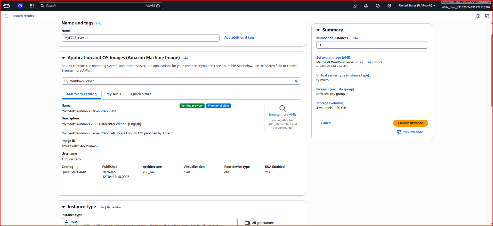
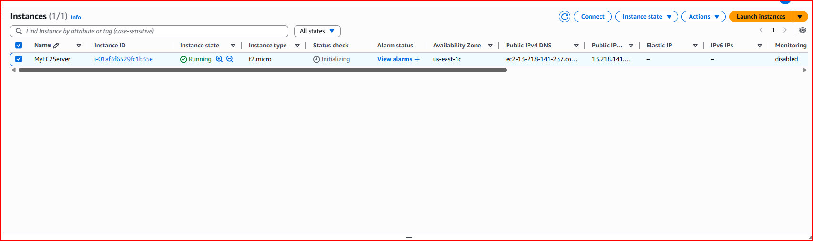
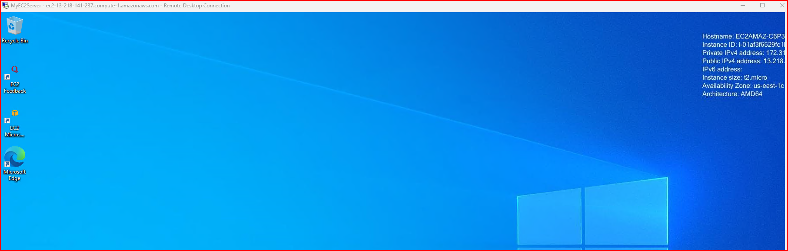
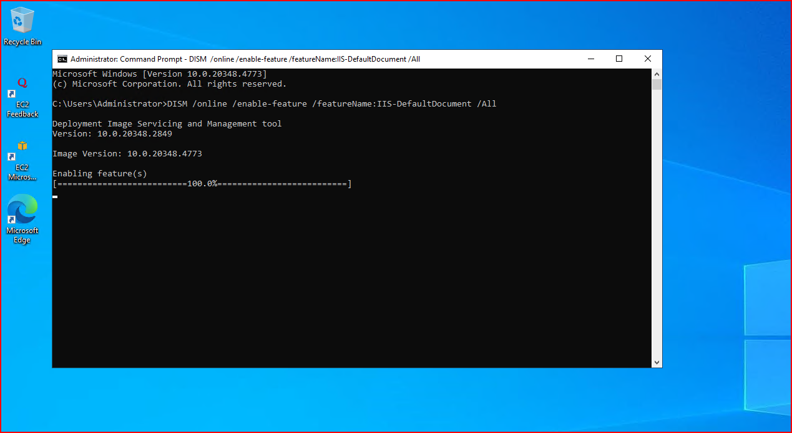
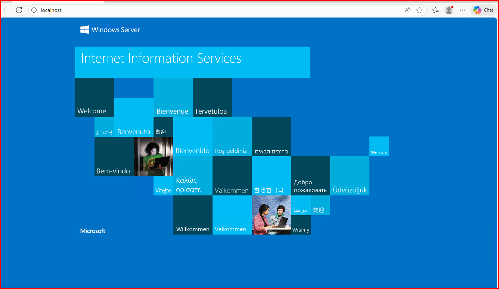

# AWS-EC2-windows-IIS-Webserver
Deploying a Windows EC2 instance on AWS and installing IIS to host a web server.

---

## Project Overview
This project demonstrates how to deploy a Windows server in AWS and configure a web server using IIS.  
The server is hosted on an EC2 instance and accessed remotely using Remote Desktop Protocol (RDP).

The project walks through launching infrastructure, configuring network access, remotely administering a cloud server, and installing a web server to host a webpage.

---

## Technologies Used
- AWS EC2
- Windows Server 2022
- IIS Web Server
- Remote Desktop Protocol (RDP)
- AWS Security Groups

---

## AWS Services Used
- Amazon EC2
- EC2 Key Pairs
- Security Groups
- Windows Server 2022 AMI

---

## Architecture

User Browser  
   |  
Internet  
   |  
AWS Security Group (RDP 3389)  
   |  
EC2 Windows Server  
   |  
IIS Web Server  
   |  
Hosted Web Page  

This architecture represents a basic cloud web hosting environment where a Windows server hosts a website using IIS.

---

## Deployment Steps

1. Launched a Windows EC2 instance in AWS  
2. Selected **Microsoft Windows Server 2022 Base** AMI  
3. Created and downloaded a key pair for secure access  
4. Configured a security group allowing RDP access on port 3389  
5. Connected to the server using Remote Desktop Protocol (RDP)  
6. Installed IIS using command line tools  
7. Verified the web server installation by loading the default webpage  

---

## What This Project Demonstrates

This project demonstrates several core cloud engineering concepts:

- Deploying infrastructure in AWS  
- Configuring network access using security groups  
- Secure remote administration of cloud servers  
- Installing and configuring a web server  
- Hosting a webpage on cloud infrastructure  

These are foundational skills required for cloud engineers managing infrastructure and application hosting in AWS environments.

---

## Real World Use Cases

This architecture is commonly used in real environments such as:

### Corporate Websites
Companies host their public websites on cloud servers running web servers like IIS.

### Internal Business Applications
Organizations deploy internal applications such as HR portals, inventory systems, or dashboards on Windows servers.

### Backend APIs
Application backends and APIs for mobile or web applications can run on cloud servers like this before scaling to larger architectures.

---

## Security Notes

For lab purposes, RDP access was allowed from anywhere:

0.0.0.0/0

In a production environment this should be restricted using:

- Specific trusted IP addresses  
- VPN access  
- Bastion host architecture  
- AWS Systems Manager Session Manager  

These controls help prevent unauthorized access to cloud infrastructure.

---

## Future Improvements

Possible improvements to this architecture include:

- Restricting RDP access to a specific IP range  
- Adding HTTPS using SSL/TLS certificates  
- Placing the EC2 instance behind an AWS Application Load Balancer  
- Automating deployment using Infrastructure as Code (Terraform or CloudFormation)  
- Deploying multiple EC2 instances with Auto Scaling  

---

## Screenshots

### Instance Configuration

### EC2 Instance Running

### Remote Desktop Connection

### Installing IIS

### IIS Default Web Page

